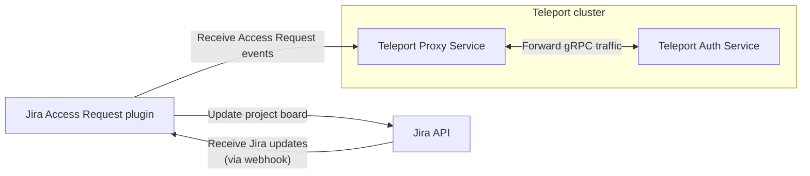

This guide will explain how to set up the Teleport Access Request plugin for
Jira. Teleport's Jira integration allows you to manage Teleport Access Requests
as Jira issues.

After installing the Jira plugin, you create a Jira project board to organize
your Access Requests, and the Jira plugin performs a two-way synchronization
between the project board and the Access Requests processed by your Teleport
cluster. When you change the status of an Access Request within Teleport, the
plugin updates the board. And when you update the status of an Access Request on
the board, the plugin updates the Access Request in Teleport.



## Prerequisites

(!/docs/pages/includes/commercial-prereqs-tabs.mdx!)

- A Jira account with permissions to create applications and webhooks.

- An environment on AWS or Google Cloud where you will run the Jira plugin. This
  is either:

  - A Linux virtual machine with port `80` and `8081` open, plus a means of
  accessing the host (e.g., OpenSSH with an SSH port exposed to your
  workstation). 

  - A Kubernetes cluster.

- (!/docs/pages/includes/tctl.mdx!)

## Step 1/9. Define RBAC resources

Before you set up the Jira plugin, you will need to enable Role Access Requests
in your Teleport cluster.

(!/docs/pages/includes/plugins/editor-request-rbac.mdx!)

## Step 2/9. Install the Teleport Jira plugin

Install the Teleport Jira plugin following the instructions below, which depend
on whether you are deploying the plugin on a host (e.g., an EC2 instance) or a
Kubernetes cluster.

<ScopedBlock scope={["enterprise", "oss"]}>

We recommend installing Teleport plugins on the same host as the Teleport Proxy
Service. This is an ideal location as plugins have a low memory footprint, and
will require both public internet access and Teleport Auth Service access. 

If you are deploying on Kubernetes, we recommend installing the Jira plugin in
the same Kubernetes cluster as the Teleport Proxy Service so the two services
can share TLS credentials.

</ScopedBlock>
<ScopedBlock scope="cloud">

Install the Teleport Jira plugin on a host (or in a Kubernetes cluster) that can
access both your Teleport Cloud tenant and Jira.

</ScopedBlock>

<Tabs>
<TabItem label="Download">
  ```code
  $ curl -L -O https://get.gravitational.com/teleport-access-jira-v(=teleport.plugin.version=)-linux-amd64-bin.tar.gz
  $ tar -xzf teleport-access-jira-v(=teleport.plugin.version=)-linux-amd64-bin.tar.gz
  $ cd teleport-access-jira
  $ sudo ./install
  ```
</TabItem>
<TabItem label="From Source">
  To install from source you need `git` and `go` installed. If you do not have Go installed, visit the Go [downloads page](https://go.dev/dl/).

  ```code
  # Checkout teleport-plugins
  $ git clone https://github.com/gravitational/teleport-plugins.git
  $ cd teleport-plugins/access/jira
  $ make
  ```
Run `./install` from `teleport-jira` or place the executable in `/usr/bin` or `/usr/local/bin` on the server installation.
</TabItem>
<TabItem label="Helm Chart">
  (!docs/pages/kubernetes-access/helm/includes/helm-repo-add.mdx!)
</TabItem>
</Tabs>

## Step 3/9. Set up HTTPS for the plugin

The Jira Access Request plugin serves a Jira webhook, which Jira notifies when
there are any changes in your Jira project (e.g., a user moves a task from one
column to another). When a change has to do with an Access Request, the Jira
plugin updates your project board and applies changes to Access Requests in
Teleport.

Jira requires webhooks to use HTTPS, which prevents third parties from
intercepting data about your Jira project and Teleport cluster. To enable HTTPS
on your Jira plugin, we will fetch TLS credentials from Let's Encrypt. 

### Create a domain name for the webhook

Jira will need to access your webhook over the public internet, so you will need
to assign a domain name to your webhook. Create a DNS record that associates
your domain name with the Jira webhook.

{/* TODO: How to find the value of the DNS record?* After that, add a simple
table of DNS record types and values*/}

### Set up TLS credentials for the webhook

Set up your environment to request TLS credentials from Let's Encrypt. The
technique we will use will depend on whether you are running the plugin as an
executable on a host or deploying it on Kubernetes.

<Notice type="warning">

The instructions in this section are intended only to illustrate how the Jira
plugin uses TLS credentials. Your organization probably has its own system for
managing TLS credentials, and that is the system you should use in production.

</Notice>

<Tabs>
<TabItem label="Executable">

We will use Caddy to run a webserver to communicate with Let's Encrypt and
manage TLS credentials. Caddy is an open source webserver with automatic HTTPS
provisioning functionality. We will use it only to provide a TLS key and
certificate to the Jira plugin.

Install Caddy on the host where you will run the plugin. For example, run the
following commands on Debian or Ubuntu hosts:

```code
$ sudo apt install -y debian-keyring debian-archive-keyring apt-transport-https
$ curl -1sLf 'https://dl.cloudsmith.io/public/caddy/stable/gpg.key' | sudo gpg --dearmor -o /usr/share/keyrings/caddy-stable-archive-keyring.gpg
$ curl -1sLf 'https://dl.cloudsmith.io/public/caddy/stable/debian.deb.txt' | sudo tee /etc/apt/sources.list.d/caddy-stable.list
$ sudo apt update
$ sudo apt install caddy
```

For other systems, follow the instructions for your system in Caddy's [installation
guide](https://caddyserver.com/docs/install).

On the host where you will run the plugin, create a directory called
`/var/teleport-jira/tls`, which is where we will configure Caddy to store TLS
credentials, and assign ownership of the `tls` directory to Caddy:

```code
$ sudo mkdir -p /var/teleport-jira/tls
$ sudo chown caddy /var/teleport-jira/tls
```

Replace `/etc/caddy/Caddyfile` with the following content, which configures
Caddy to fetch TLS credentials for your Jira webhook's domain name. Replace
`example.com` with the domain name you created earlier:

```text
{
  storage file_system /var/teleport-jira/tls
}

https://example.com
```

<Notice type="warning">

The address you include in your `Caddyfile` must use the `https://` scheme for
Caddy to fetch TLS credentials.

</Notice>

If you installed Caddy using a package manager earlier, it will already be
running. Restart Caddy with the following command:

```code
$ sudo systemctl restart caddy
```

<Details title="Did Caddy fail to start?">

If your system does not use `systemd` to manage services, run the following
command to start Caddy as a daemon:

```code
$ sudo caddy run --config /etc/caddy/Caddyfile
```

</Details>

Caddy will fetch credentials from Let's Encrypt automatically and place them in
`/var/teleport-jira/tls`. Your Caddy logs should be similar to the following:

```code
$ sudo journalctl -u caddy | grep "success"
Aug 26 17:04:27 ip-000-000-000-000 caddy[17719]:
{"level":"info","ts":1661533467.3145745,"logger":"tls.issuance.acme.acme_client","msg":"successfully
downloaded available certificate
chains","count":2,"first_url":"https://acme-v02.api.letsencrypt.org/acme/cert/000000000000000000000000000000000000"}
Aug 26 17:04:27 ip-000-000-000-000 caddy[17719]:
{"level":"info","ts":1661533467.3151438,"logger":"tls.obtain","msg":"certificate
obtained successfully","identifier":"example.com"}
```

You can find your credentials at the following paths, where `example.com` is the
domain name you created earlier:

- `/var/teleport-jira/tls/certificates/acme-v02.api.letsencrypt.org-directory/example.com/example.com.crt`
- `/var/teleport-jira/tls/certificates/acme-v02.api.letsencrypt.org-directory/example.com/example.com.key`

</TabItem>
<TabItem label="Helm Chart">

Use cert-manager to communicate with Let's Encrypt and generate a Kubernetes
secret containing TLS credentials that the pugin can use. 

If you do not have `cert-manager` already configured in the Kubernetes cluster
where you are installing Teleport, add the Jetstack Helm chart repository which
hosts the `cert-manager` chart, and install the chart:

```code
$ helm repo add jetstack https://charts.jetstack.io
$ helm repo update
$ helm install cert-manager jetstack/cert-manager \
--create-namespace \
--namespace cert-manager \
--set installCRDs=true
```

Install the NGINX ingress controller, which `cert-manager` will use to expose a
web server to Let's Encrypt:

```code
$ helm upgrade --install ingress-nginx ingress-nginx \
--repo https://kubernetes.github.io/ingress-nginx \
--namespace cert-manager \
--set extraArgs="{--issuer-ambient-credentials}"
```

Once `cert-manager` is installed, create and apply an `Issuer` resource that
configures `cert-manager` to fetch TLS credentials from Let's Encrypt. Create a
file called `issuer.yaml` with the following content:

```yaml
apiVersion: cert-manager.io/v1
kind: Issuer
metadata:
  name: letsencrypt-production
  namespace: teleport
spec:
  acme:
    email: email@address.com                                # Change this
    server: https://acme-v02.api.letsencrypt.org/directory
    privateKeySecretRef:
      name: letsencrypt-production
    solvers:
    - http01:
        ingress:
          class: nginx
```

`cert-manager` will create a new Kubernetes `Ingress` resource, and the `nginx`
controller will expose a web server that Let's Encrypt will use, via the
ACME-HTTP01 challenge, to prove that you have control over your domain name.

You'll need to replace `email@address.com` with an email address where you can
receive communications from Let's Encrypt.

After you have created the `Issuer` and updated the values, add it to your
cluster using `kubectl`:

```code
$ kubectl create namespace teleport
$ kubectl create -f issuer.yaml
```

Next, create a cert-manager `Certificate` resource. Add the following to a file
called `certificate.yaml`:

{/* TODO: Fill in the template below, which I copied from the teleport-cluster
Helm chart*/} 

```yaml
apiVersion: cert-manager.io/v1
kind: Certificate
metadata:
  name: {{ .Release.Name }}
  namespace: {{ .Release.Namespace }}
  labels: {{- include "teleport-cluster.proxy.labels" . | nindent 4 }}
spec:
  secretName: teleport-tls
  {{- if $proxy.highAvailability.certManager.addCommonName }}
  commonName: {{ quote $domain }}
  {{- end }}
  dnsNames:
  - {{ quote $domain }}
  - {{ quote $domainWildcard }}
  issuerRef:
    name: {{ required "highAvailability.certManager.issuerName is required in chart values" $proxy.highAvailability.certManager.issuerName }}
    kind: {{ required "highAvailability.certManager.issuerKind is required in chart values" $proxy.highAvailability.certManager.issuerKind }}
    group: {{ required "highAvailability.certManager.issuerGroup is required in chart values" $proxy.highAvailability.certManager.issuerGroup }}
  {{- with $proxy.annotations.certSecret }}
  secretTemplate:
    annotations: {{- toYaml . | nindent 6 }}
  {{- end }}
```

</TabItem>
</Tabs>

## Step 4/9. Create a user and role for the plugin

(!docs/pages/includes/plugins/rbac.mdx!)

## Step 5/9. Export the access plugin identity

(!docs/pages/includes/plugins/identity-export.mdx user="access-plugin"!)

## Step 6/9. Set up a Jira project

The Teleport Jira plugin assumes that you have created a project where it can
post tasks when a Teleport user creates an Access Request. The plugin then uses
the Jira webhook to monitor the state of the board and respond to any changes in
the tickets it creates.

### Create a project for managing Access Requests

In Jira, find the top navigation bar and click **Projects** -> **Create
project**. Select **Kanban** for the template, then **Use template**. Click
**Select a company-managed project**.

You'll see a screen where you can enter a name for your project. In this guide,
we will assume that your project is called "Teleport Access Requests", which
receives the key `TAR` by default. Click **Create project**. 

In the three-dots menu on the upper right of your new board, click **Board
settings**, then click **Columns**. Edit the columns in your board so it
contains the following four:

1. Pending
1. Approved
1. Denied
1. Expired

<Notice type="warning">

If your project board does not contain these (and only these) columns, the Jira
Access Request plugin will behave in unexpected ways.

</Notice>

Teleport's Jira plugin will create a new issue for each new permission request
in the first available column on the board. When you drag the request task to
the Approved column in Jira, the request will be approved. If you drag the
request task to the Denied column in Jira, the request will be denied.

Click **Back to board** to review your changes.

### Set up a request ID field on Jira

The Teleport Jira plugin expects tasks in the Teleport Access Requests project
to include a field called `teleportAccessRequestId`, which it uses to track
individual Access Requests. This prevents users from tampering with or forging
Access Requests.

To set up the `teleportAccessRequestId` field, click **Project settings** on the
left navigation bar, then click **Issues** -> **Fields**. In the **Actions**
menu, click **Edit fields**. Click the **Custom fields** tab in the left
sidebar, then **Create custom field**. Add a **Short Text** field named
`teleportAccessRequestId`. Click the checkbox next to **Default Screen** to
associate that field with this screen. Click **Update**.

Next, add the custom field to your Teleport Access Requests project. Click
**Project settings**. Click **Issues** -> **Types** on the left sidebar, then
click **Task**. Find the dropdown menu called **Select Field**, then select the
`teleportAccessRequestId` field you added earlier.

### Retrieve your Jira API token

Obtain an API token that the Teleport Access Request plugin will use to make
changes to your Jira project. Click the gear menu at the upper right of the
screen, then click **Atlassian account settings**. Click **Security** ->
**Create and manage API tokens** -> **Create API token**. 

Choose any label and click **Copy**. Paste the API token somewhere safe so you
can use it later in this guide when you configure the Jira plugin.

### Set up a Jira webhook

Now that you have generated an API key that the Teleport Jira plugin will use to
manage your project, enable Jira to notify the Teleport Jira plugin when your
project is updated by creating a webhook.

Click the gear menu on the upper right of the screen. Click **System** ->
**WebHooks** -> **Create a WebHook**. 

Enter "Teleport Access Request Plugin" in the "Name" field. In the "URL" field,
enter the domain name you created for the plugin earlier, plus port `8081`.

The webhook needs to be notified only when an issue is created, updated, or
deleted. You can leave all the other boxes empty.

Click **Create**.

## Step 7/9. Configure the plugin

At this point, you have retrieved credentials that the Jira plugin will use to
connect to Teleport and the Jira API. You will now configure the plugin to use
these credentials and run the Jira webhook at the address you configured
earlier.

The Teleport email plugin uses a config file in TOML format. On the host where
you will run the Jira plugin, generate a boilerplate config by running the
following command:

```code
$ teleport-jira configure > teleport-jira.toml
$ sudo mv teleport-jira.toml /etc
```

Edit the configuration file for your environment. We will show you how to set
each value below.

### `teleport`

(!docs/pages/includes/plugins/config-toml-teleport.mdx!)

### `jira`

<Tabs>
<TabItem label="Executable">

Assign `url` to the URL of your Jira tenant, e.g.,
`https://[your-jira].atlassian.net`, `username` to the username you were logged
in as when you created your API token, and `api_token` to the API token you
retrieved earlier. Also assign `project` to the project key for your project,
which in our case is `TAR`.

You can leave `issue_type` as `Task` or remove the field, as `Task` is the
default.
</TabItem>
<TabItem label="Helm Chart">

Assign `url` to the URL of your Jira tenant, e.g.,
`https://[your-jira].atlassian.net`, `username` to the username you were logged
in as when you created your API token, and `apiToken` to the API token you
retrieved earlier. Also assign `project` to the project key for your project,
which in our case is `TAR`.

You can leave `issueType` as `Task` or remove the field, as `Task` is the
default.
</TabItem>
</Tabs>

### `http`

<Tabs>
<TabItem label="Executable">

The `[http]` setting block describes how the plugin's webhook works. 

`listen_addr` indicates the address that the plugin will listen on, and defaults
to `:8081`. If you opened 8081 on your plugin host as we recommended earlier in
the guide, you can leave this option unset.

`public_addr` is the public address of your webhook. This is the domain name you
added to the DNS A record you created earlier.

`key_file` and `cert_file` correspond to the private key and certificate you
generated earlier via Caddy. Use the following values, replacing `example.com`
with the domain name you created for the plugin earlier:

- `https_key_file`: `/var/teleport-jira/tls/certificates/acme-v02.api.letsencrypt.org-directory/example.com/example.com.key`
- `https_cert_file`: `/var/teleport-jira/tls/certificates/acme-v02.api.letsencrypt.org-directory/example.com/example.com.crt`

</TabItem>
<TabItem label="Helm Chart">

The `http` setting block describes how the plugin's webhook works. 

`publicAddress` is the public address of your webhook. This is the domain name you
added to the DNS A record you created earlier.

`tlsKeySecretPath` and `tlsCertSecretPath` correspond to the name of the TLS key and certificate inside the secret you created earlier.
</TabItem>
</Tabs>

The final configuration will resemble the following:

<Tabs>
<TabItem label="Executable">

```toml
(!examples/resources/plugins/teleport-jira-cloud.toml!)
```

</TabItem>
<TabItem label="Helm Chart" >

```yaml
(!examples/resources/plugins/teleport-jira-helm-cloud.yaml!)
```

{/* TODO: Move the secret creation instructions elsewhere, since the
section of this guide re: configuring the Helm chart already refers to the
identity file secret*/}

Use the following command to create the Kubernetes secret referenced in the
values file from the identity file you generated earlier:

```console
kubectl create secret generic teleport-plugin-jira-identity --from-file=auth_id=auth.pem
```
</TabItem>
</Tabs>

## Step 8/9. Test the Jira plugin

After finishing your configuration, you can now run the plugin and test your
Jira-based Access Request flow:

<Tabs>
<TabItem label="Executable" scopes={["oss", "enterprise", "cloud"]}>
```code
$ teleport-jira start
```
</TabItem>
<TabItem label="Helm Chart" scopes={["oss", "enterprise", "cloud"]}>
```code
$ helm install teleport-plugin-jira teleport/teleport-plugin-jira \
  --values teleport-jira-helm.yaml \
  --version (=teleport.plugin.version=)
```
</TabItem>
</Tabs>

### Check the status of the webhook

Confirm that the Jira webhook has started serving by sending a GET request to
the `/status` endpoint.

{/* TODO: Show how to do this*/}

If the webhook returns a `200` status, it measn that the webhook is running.

### Create an Access Request

(!docs/pages/includes/plugins/create-request.mdx!)

When you create the request, you will see a new task in the "Pending" column of
the Teleport Access Requests board:


{/* TODO: The instructions for editing column names are wrong, since "Backlog"
is still the first column. Change this, then edit the screenshot to include the
correct column in the dropdown menu*/}

### Resolve the request

Move the card corresponding to your new Access Request to the "Denied" column,
then click the card and navigate to Teleport. You will see that the Access
Request has been denied.

<Admonition title="Auditing Access Requests">

Anyone with access to the Jira project board can modify the status of Access
Requests reflected on teh board. You can check the Teleport audit log to ensure
that the right users are reviewing the right requests.

When auditing Access Request reviews, check for events with the type `Access
Request Reviewed` in the Teleport Web UI.

</Admonition>

## Step 9/9. Set up systemd

In production, we recommend starting the Teleport plugin daemon via an init
system like systemd. Here's the recommended Teleport plugin service unit file
for systemd:

```txt
(!examples/systemd/plugins/teleport-jira.service!)
```

Save this as `teleport-jira.service` or another [unit file load
path](https://www.freedesktop.org/software/systemd/man/systemd.unit.html#Unit%20File%20Load%20Path)
supported by systemd.

```code
$ sudo systemctl enable teleport-jira
$ sudo systemctl start teleport-jira
```

## Feedback

If you have any issues with this plugin, please create a GitHub issue in our
[`gravitational/teleport-plugins`](https://github.com/gravitational/teleport-plugins/issues/new)
repo.
